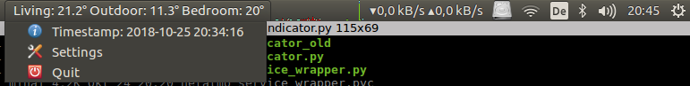

# Netatmo Indicator [](https://opensource.org/licenses/MIT)

Ubuntu debian package deployment of a Menubar indicator for the Netatmo Weather Station

## Installation
```
sudo add-apt-repository ppa:mihaigalos/ppa
sudo apt-get update
sudo apt install netatmo-indicator
netatmo-indicator &
```

## Removal
```
sudo apt remove --purge netatmo-indicator
```

## Screenshots



## Settings
The indicator stores its settings in `~/.netatmo-indicator-preferences.yaml`, with an additional credentials file
for netatmo. The credentials' file is referenced with the <credentials_file> tag in ~/.netatmo-indicator-preferences.yaml

One may edit the credentials directly in the Menu.

If desired, one may edit the ~/.netatmo-indicator-preferences.yaml and add a dictionary of aliases to substitute the
names displayed. Make sure to close the indicator before you manually edit the file.

Example:
```
aliases:
  Living: In
  Outdoor: Out
  Bedroom: Bed
```

## A note on credentials
When the indicator first starts, the user is presented with the settings menu. One needs to fill in his netatmo username, password, cilentId and clientSecret. All this information can be gathered from the user's netatmo profile.

## Integration with I3WM
One may choose to use the purely awesome i3 window manager. Change the `/etc/i3status.conf` so it contains:

```
general {
        colors = true
        interval = 60
        output_format = "i3bar"
}
```

Next, edit your `/.config/i3/config` remove the `bar` block and replace it with:
```
bar {
    status_command <path_to_netatmo_indicator>/i3wm_wrapper.sh
}
```

## Deployment [Self Note]
This is a self note. You do not need this for normal indicator usage.
##### Check if key already available
`gpg --list-secret-keys`

##### Generate key if not available
```
gpg --gen-key
gpg -a --output ~/.gnupg/mihaigalos.gpg --export 'Mihai Galos'
gpg --import ~/.gnupg/mihaigalos.gpg
```

##### Debian Package Generation
###### Generation for local usage / binary build
`dpkg-buildpackage -b -pgpg -kmihaigalos@gmail.com`

###### Generation for local deployment / source build
Launchpad (i.e.) only accepts source builds, and to avoid errors, we need an original version of the package see [askubuntu](https://askubuntu.com/questions/1087569/deploying-own-debian-package-to-launchpad) for further info.

The current folder contains i.e. `.git` which we do not want to deploy. We thus make a new folder `foo` and create the package there.

```
(in the git folder)
current_directory=$(basename "$PWD")

mkdir -p ../foo/${current_directory} && find . -mindepth 1 -maxdepth 1 -exec cp {*indicator,*.py,*.desktop,*.md} ../foo/${current_directory} \; && cp -r debian ../foo/${current_directory}
cd ../foo
tar -czvf ${current_directory}_0.1.orig.tar.gz ${current_directory}
cd ${current_directory}

dpkg-buildpackage -S -pgpg -kmihaigalos@gmail.com
```

##### Prepare for upload to Launchpad
###### Prerequisites:
* Ubuntu One account active
* gpg key used to sign the debian uploaded to Ubuntu Keyserver:
 - `gpg --list-keys`
 - `gpg  --keyserver hkp://keyserver.ubuntu.com:11371 --send-keys <KEY>`)
* OpenPGP keys displays the key

###### Upload source:
`dput ppa:mihaigalos/ppa *source.changes`
